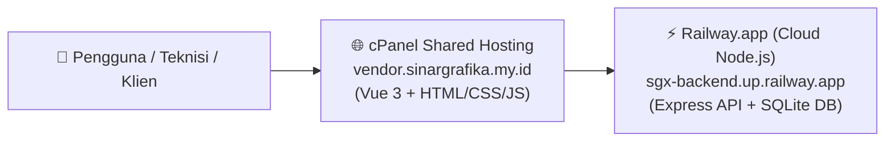

# 🚀 PANDUAN DEPLOYMENT HYBRID (FRONTEND: cPANEL + BACKEND: RAILWAY / RENDER)

Panduan ini disusun khusus untuk Anda yang memiliki **cPanel shared hosting tanpa fitur Node.js**, agar aplikasi **SGX Vendor Work Evidence** tetap dapat berjalan lancar di subdomain **`https://vendor.sinargrafika.my.id`** secara **100% GRATIS, CEPAT, & OTOMATIS** menggunakan **Railway.app**.

---

## 🏗️ Gambaran Arsitektur Hybrid



- **Frontend (Tampilan Web)**: Berjalan di **cPanel** Anda di folder `vendor.sinargrafika.my.id` (menggunakan file statis ringan + `.htaccess`).
- **Backend (API Server & Database)**: Berjalan di **[Railway.app](https://railway.app)** (karena cPanel tidak ada Node.js), terhubung langsung ke GitHub Anda (`rzaoesman-create/sgx-vendor-app`).

---

## 📌 DAFTAR ISI
1. [Tahap 1: Deploy Backend Node.js di Railway.app (5 Menit)](#tahap-1-deploy-backend-nodejs-di-railwayapp-5-menit)
2. [Tahap 2: Buat Subdomain di cPanel Hosting](#tahap-2-buat-subdomain-di-cpanel-hosting)
3. [Tahap 3: Build & Upload Frontend ke cPanel](#tahap-3-build--upload-frontend-ke-cpanel)
4. [Tahap 4: Cara Update Aplikasi di Masa Depan (Otomatis)](#tahap-4-cara-update-aplikasi-di-masa-depan-otomatis)

---

## Tahap 1: Deploy Backend Node.js di Railway.app (5 Menit)

### 1.1 Daftar / Login ke Railway
1. Buka website: **[https://railway.app](https://railway.app)**
2. Klik tombol **"Login"** (di pojok kanan atas) → pilih **"Login with GitHub"**.
3. Izinkan akses untuk akun GitHub Anda (`rzaoesman-create`).

### 1.2 Buat Proyek Baru dari GitHub Repo
1. Di dashboard Railway, klik tombol **"+ New Project"**.
2. Pilih **"Deploy from GitHub repo"**.
3. Pilih repository Anda: **`rzaoesman-create/sgx-vendor-app`**.
4. Klik **"Deploy Now"**.

### 1.3 Konfigurasi Root Directory & Start Command di Railway
1. Klik kotak service proyek yang baru dibuat di Railway.
2. Buka tab **"Settings"**:
   - Scroll ke bagian **"Root Directory"** → klik **Edit** → isi: `/server` (agar Railway fokus menjalankan backend di folder `server`).
   - Pada bagian **"Start Command"** → klik **Edit** → isi: `node src/index.js`.
3. Buka tab **"Variables"** (Environment Variables) → klik **"+ New Variable"** dan tambahkan 4 variabel ini:
   | Variable Name | Value |
   | :--- | :--- |
   | **`NODE_ENV`** | `production` |
   | **`JWT_SECRET`** | `sgx_sinargrafika_sec_98234789123891238912389` |
   | **`CORS_ORIGIN`** | `https://vendor.sinargrafika.my.id` |
   | **`PORT`** | `5000` |

### 1.4 Dapatkan Domain Publik Backend Anda
1. Di tab **"Settings"**, scroll ke bagian **"Networking"** (Public Networking).
2. Klik tombol **"Generate Domain"**.
3. Anda akan mendapatkan URL domain backend Anda, contoh:
   ```text
   https://sgx-vendor-production.up.railway.app
   ```
4. 🎉 **Backend Anda sekarang sudah online dan aktif di seluruh dunia!** Salin URL domain tersebut.

---

## Tahap 2: Buat Subdomain di cPanel Hosting

1. Login ke dashboard **cPanel** hosting Anda.
2. Cari dan klik menu **Domains** (atau **Subdomains**).
3. Klik tombol **"Create A New Domain"**.
4. Masukkan nama domain: **`vendor.sinargrafika.my.id`**
5. ⚠️ **JANGAN CENTANG** kotak *"Share document root with sinargrafika.my.id"*.
6. Pastikan Document Root diarahkan ke: `vendor.sinargrafika.my.id`.
7. Klik **Submit**.

---

## Tahap 3: Build & Upload Frontend ke cPanel

Sekarang kita hubungkan tampilan frontend ke backend Railway yang baru saja dibuat.

### 3.1 Pasang URL Backend di Laptop & Jalankan Build
1. Buka file [`.env`](file:///d:/ANTIGRAFYTI/SGX_VENDOR/client/.env) di dalam folder `client/` (atau buat file `client/.env.production`).
2. Masukkan URL backend Railway Anda (tambahkan `/api` di ujungnya):
   ```env
   VITE_API_URL=https://sgx-vendor-production.up.railway.app/api
   ```
   *(Ganti `https://sgx-vendor-production.up.railway.app` dengan domain asli Railway Anda di Tahap 1.4).*

3. Buka terminal di laptop Anda dan jalankan perintah build:
   ```bash
   cd d:\ANTIGRAFYTI\SGX_VENDOR\client
   npm run build
   ```

### 3.2 Upload Hasil Build ke cPanel
1. Buka folder `client/dist/` di laptop Anda.
2. Di dalam folder `dist/` terdapat:
   - Folder `assets/`
   - File `index.html`
   - File `.htaccess`
3. Pilih semua file di dalam `client/dist/`, lalu kompres menjadi file **ZIP** (misal: `frontend.zip`).
4. Buka **cPanel File Manager** → buka folder **`vendor.sinargrafika.my.id`**.
5. Upload file `frontend.zip` ke folder tersebut.
6. Klik kanan pada `frontend.zip` → pilih **Extract**.
7. Buka browser dan akses: **`https://vendor.sinargrafika.my.id`**
   🎉 **SELESAI! Aplikasi Anda sekarang sudah LIVE dan berfungsi 100%!**

---

## Tahap 4: Cara Update Aplikasi di Masa Depan (Otomatis)

Dengan arsitektur ini, pembaruan di masa depan sangatlah nyaman:

1. **Jika Ada Perubahan Logika Server / API (Backend)**:
   - Anda cukup coding di laptop, lalu jalankan `git push`.
   - ⚡ **Railway akan otomatis mendeteksi dan meng-update backend server Anda secara otomatis dalam hitungan detik (*Auto-Deploy*)!** Anda tidak perlu membuka website Railway lagi.
2. **Jika Ada Perubahan Tampilan (Frontend)**:
   - Jalankan `npm run build` di laptop, lalu upload file ZIP baru dari `client/dist` ke folder `vendor.sinargrafika.my.id` di cPanel.

---

## 🔑 Akun Login Bawaan di Website Anda:
- **Super Admin**: `superuser@sgx.com` (Password: `admin123`)
- **Admin Operasional**: `admin@sgx.com` (Password: `admin123`)
- **Tim Lapangan**: `andi.lapangan@sgx.com` (Password: `admin123`)
- **Klien Indomaret**: `reza.indomarco@sgx-partner.com` (Password: `admin123`)
